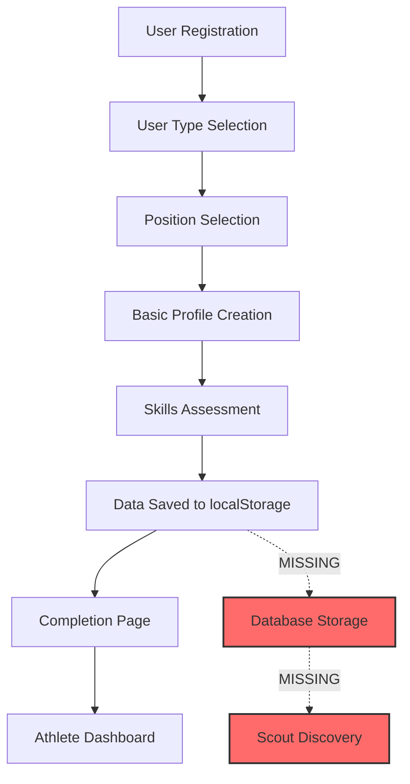

# Comprehensive Self-Assessment Implementation Analysis & Strategic Enhancement Plan

## Executive Summary

This document provides an exhaustive analysis of the current self-assessment implementation within the athlete recruitment platform. Through meticulous investigation of the codebase, we have identified critical gaps in data persistence, scout visibility, verification mechanisms, and system integration. This analysis covers the complete information flow from athlete input through scout discovery, examining every component, API endpoint, database schema, and user interface element.

## Table of Contents

1. [Current State Analysis](#1-current-state-analysis)
2. [Information Flow Mapping](#2-information-flow-mapping)
3. [Database Architecture Analysis](#3-database-architecture-analysis)
4. [Frontend Implementation Deep Dive](#4-frontend-implementation-deep-dive)
5. [Backend Services Examination](#5-backend-services-examination)
6. [Scout Platform Integration](#6-scout-platform-integration)
7. [Trust Pyramid System Analysis](#7-trust-pyramid-system-analysis)
8. [Video & AI Infrastructure Assessment](#8-video--ai-infrastructure-assessment)
9. [Critical Gaps & Missing Components](#9-critical-gaps--missing-components)
10. [Comprehensive Enhancement Strategy](#10-comprehensive-enhancement-strategy)
11. [Implementation Roadmap](#11-implementation-roadmap)
12. [Technical Specifications](#12-technical-specifications)

---

## 1. Current State Analysis

### 1.1 Self-Assessment Location & Structure

**Primary File**: `/client/src/pages/auth/skills.tsx`

The self-assessment system consists of four interactive assessment components:

#### Speed Assessment Component (Lines 26-132)
```typescript
function SpeedAssessment({ onComplete }: { onComplete: (data: any) => void }) {
  // Three input methods:
  const [selfRating, setSelfRating] = useState<string>(""); 
  // Options: "slower", "average", "above_average", "fastest"
  
  const [time50m, setTime50m] = useState<string>(""); 
  // Numeric input for 50m sprint time
  
  const [speedSlider, setSpeedSlider] = useState<number>(5); 
  // Visual slider 1-10 scale
}
```

**Data Collected**:
- Self-comparison rating against peers
- Specific 50m sprint time (optional)
- Visual slider rating (1-10)

#### Strength Assessment Component (Lines 134-229)
```typescript
function StrengthAssessment({ onComplete }: { onComplete: (data: any) => void }) {
  const [ballDisputes, setBallDisputes] = useState<string>("");
  // Options: "win_most", "fifty_fifty", "avoid"
  
  const [teamComparison, setTeamComparison] = useState<number>(5);
  // Slider comparing to current team (1-10)
}
```

**Data Collected**:
- Ball dispute preference/ability
- Strength comparison within current team

#### Technique Assessment Component (Lines 231-348)
```typescript
function TechniqueAssessment({ onComplete }: { onComplete: (data: any) => void }) {
  const [skills, setSkills] = useState<Record<string, number>>({
    shortPass: 0,    // 1-5 rating
    longPass: 0,     // 1-5 rating
    control: 0,      // 1-5 rating
    finishing: 0     // 1-5 rating
  });
  const [preferredFoot, setPreferredFoot] = useState<string>("");
  // Options: "left", "right", "both"
}
```

**Data Collected**:
- Individual skill ratings (1-5 scale)
- Foot preference

#### Stamina Assessment Component (Lines 350-449)
```typescript
function StaminaAssessment({ onComplete }: { onComplete: (data: any) => void }) {
  const [duration, setDuration] = useState<string>("");
  // Options: "45", "60", "90", "90+"
  
  const [recovery, setRecovery] = useState<string>("");
  // Options: "fast", "normal", "slow"
}
```

**Data Collected**:
- High-intensity duration capability
- Recovery rate after sprints

### 1.2 Data Storage Mechanism

**Current Implementation** (Line 500):
```typescript
localStorage.setItem("authSkills", JSON.stringify(dataToSave));
```

**Critical Finding**: Skills data is ONLY stored in browser localStorage, NOT persisted to database.

### 1.3 Data Retrieval Points

1. **Athlete Dashboard** (`/client/src/pages/athlete/dashboard.tsx`):
   ```typescript
   // Lines 106-108
   const authPosition = JSON.parse(localStorage.getItem("authPosition") || "{}");
   const authProfile = JSON.parse(localStorage.getItem("authProfile") || "{}");
   const authSkills = JSON.parse(localStorage.getItem("authSkills") || "{}");
   ```

2. **Trust Pyramid Calculator** (`/client/src/lib/trustPyramidCalculator.ts`):
   ```typescript
   // Lines 63-65
   const authSkills = typeof window !== 'undefined' 
     ? JSON.parse(localStorage.getItem("authSkills") || "{}") 
     : {};
   ```

---

## 2. Information Flow Mapping

### 2.1 Complete User Journey



### 2.2 Current Data Flow

1. **Input Stage**:
   - User completes 4-step assessment
   - Data validated on frontend only
   - Stored in component state

2. **Storage Stage**:
   - Data serialized to JSON
   - Saved to localStorage key "authSkills"
   - No backend API call

3. **Display Stage**:
   - Retrieved from localStorage on dashboard
   - Used for Trust Pyramid calculation
   - Not visible to scouts

### 2.3 Missing Data Flow

1. **Persistence Gap**:
   - No API endpoint for skills data
   - No database fields for storage
   - Data lost on browser clear

2. **Scout Visibility Gap**:
   - Skills not included in athlete profiles
   - No filtering by skill levels
   - No verification indicators

---

## 3. Database Architecture Analysis

### 3.1 Current Schema Structure

**Athletes Table** (`/shared/schema.ts`):
```typescript
export const athletes = pgTable("athletes", {
  id: serial("id").primaryKey(),
  userId: varchar("user_id").notNull().references(() => users.id),
  fullName: varchar("full_name").notNull(),
  birthDate: date("birth_date").notNull(),
  position: varchar("position").notNull(),
  dominantFoot: varchar("dominant_foot", { enum: ["left", "right", "both"] }),
  height: integer("height"),
  weight: integer("weight"),
  verificationLevel: varchar("verification_level", { 
    enum: ["bronze", "silver", "gold", "platinum"] 
  }).default("bronze"),
  // MISSING: skillsAssessment field
});
```

**Tests Table**:
```typescript
export const tests = pgTable("tests", {
  id: serial("id").primaryKey(),
  athleteId: integer("athlete_id").notNull(),
  testType: varchar("test_type").notNull(),
  videoUrl: text("video_url"),
  result: decimal("result", { precision: 6, scale: 3 }),
  aiConfidence: decimal("ai_confidence", { precision: 5, scale: 4 }),
  verified: boolean("verified").default(false),
  verifiedBy: varchar("verified_by"),
  metadata: jsonb("metadata"),
});
```

### 3.2 Missing Schema Elements

1. **Skills Assessment Storage**:
   ```sql
   -- Proposed addition to athletes table
   ALTER TABLE athletes 
   ADD COLUMN skills_assessment JSONB,
   ADD COLUMN skills_verified BOOLEAN DEFAULT FALSE,
   ADD COLUMN skills_verification_date TIMESTAMP,
   ADD COLUMN skills_verified_by VARCHAR;
   ```

2. **Skills History Tracking**:
   ```sql
   -- Proposed new table
   CREATE TABLE skills_assessment_history (
     id SERIAL PRIMARY KEY,
     athlete_id INTEGER REFERENCES athletes(id),
     assessment_data JSONB NOT NULL,
     assessment_type VARCHAR NOT NULL,
     created_at TIMESTAMP DEFAULT NOW()
   );
   ```

---

## 4. Frontend Implementation Deep Dive

### 4.1 Component Architecture

```
/client/src/
├── pages/
│   └── auth/
│       ├── skills.tsx (Main assessment page)
│       ├── position.tsx (Position selection)
│       ├── profile.tsx (Basic profile)
│       └── complete.tsx (Completion page)
├── components/
│   └── features/
│       └── athlete/
│           └── TrustPyramidProgressWidget.tsx
└── lib/
    └── trustPyramidCalculator.ts
```

### 4.2 State Management Analysis

**Current Approach**:
- Component-level state using React hooks
- No global state management
- localStorage as pseudo-database

**Issues Identified**:
1. State lost on navigation without completion
2. No draft saving capability
3. No session recovery mechanism
4. No conflict resolution for multiple devices

### 4.3 UI/UX Considerations

**Strengths**:
- Interactive, gamified interface
- Progressive disclosure pattern
- Visual feedback mechanisms
- Mobile-responsive design

**Weaknesses**:
- No save progress feature
- No edit capability after submission
- No validation against unrealistic values
- No comparison benchmarks shown

---

## 5. Backend Services Examination

### 5.1 API Endpoints Analysis

**Current Endpoints** (`/server/routes.ts`):

```typescript
// Athlete-related endpoints
app.get("/api/athletes", async (req, res) => {...})
app.post("/api/athletes", async (req, res) => {...})
app.get("/api/athletes/:id", async (req, res) => {...})
app.put("/api/athletes/:id", async (req, res) => {...})

// Missing: Skills-specific endpoints
```

### 5.2 Storage Layer Implementation

**DatabaseStorage Class** (`/server/storage.ts`):

```typescript
export class DatabaseStorage implements StorageAdapter {
  async createAthlete(data: InsertAthlete): Promise<Athlete> {
    // Current implementation doesn't handle skills data
    const [athlete] = await db.insert(athletes).values(data).returning();
    return athlete;
  }
  
  // Missing methods:
  // - updateAthleteSkills()
  // - getAthleteSkills()
  // - verifySkills()
}
```

### 5.3 Missing Backend Components

1. **Skills Service**:
   ```typescript
   // Proposed service
   class SkillsAssessmentService {
     async saveAssessment(athleteId: number, data: SkillsData)
     async getAssessment(athleteId: number)
     async updateVerificationStatus(athleteId: number, status: boolean)
     async calculateSkillPercentiles(athleteId: number)
   }
   ```

2. **Validation Layer**:
   ```typescript
   // Proposed validation
   const skillsAssessmentSchema = z.object({
     speed: z.object({
       selfRating: z.enum(['slower', 'average', 'above_average', 'fastest']),
       specificMetric: z.number().min(5).max(15).optional(),
       sliderValue: z.number().min(1).max(10)
     }),
     // ... other assessments
   });
   ```

---

## 6. Scout Platform Integration

### 6.1 Current Scout Search Implementation

**Scout Search Page** (`/client/src/pages/scout/search.tsx`):

```typescript
const [filters, setFilters] = useState({
  search: "",
  position: "",
  state: "",
  ageRange: [14, 18],
  verificationLevel: "",
  // MISSING: skill-based filters
});
```

### 6.2 Athlete Display to Scouts

**Current Display** (Lines 179-221):
- Basic info: Name, position, age
- Location: City, state
- Physical: Dominant foot
- Verification: Level badge

**Missing Elements**:
- Skill ratings display
- Performance metrics
- Verification status for each skill
- Comparison tools

### 6.3 Scout Filtering Capabilities

**Current Filters**:
1. Text search (name, city)
2. Position
3. State
4. Age range
5. Verification level

**Missing Filters**:
1. Speed rating range
2. Strength level
3. Technical skills minimum
4. Stamina requirements
5. Verified vs self-reported

---

## 7. Trust Pyramid System Analysis

### 7.1 Calculator Implementation

**Trust Pyramid Calculator** (`/client/src/lib/trustPyramidCalculator.ts`):

```typescript
bronze: {
  requirements: [
    {
      id: 'skills_assessment',
      label: 'Autoavaliação de Habilidades',
      completed: !!(authSkills.speed && authSkills.strength && authSkills.agility),
      weight: 10
    }
  ]
}
```

### 7.2 Current Issues

1. **Frontend-Only Calculation**:
   - Relies on localStorage data
   - Not synced with database verificationLevel
   - Recalculated on every page load

2. **Missing Backend Integration**:
   - No API to update verification level
   - No triggers on requirement completion
   - No notification system

### 7.3 Trust Pyramid Levels Analysis

**Bronze Level** (25% weight):
- ✅ Basic Profile (10%)
- ✅ Physical Stats (5%)
- ❌ Skills Assessment (10%) - Frontend only

**Silver Level** (40% weight):
- ❌ First Verified Test (15%)
- ✅ Profile Photo (10%)
- ❌ Three Tests Completed (15%)

**Gold Level** (60% weight):
- ❌ Three Verified Tests (25%)
- ❌ 100% Profile Complete (15%)
- ❌ Video Highlights (20%)

**Platinum Level** (75% weight):
- ❌ All Combine Tests (30%)
- ❌ Coach Endorsement (20%)
- ❌ Elite Performance (25%)

---

## 8. Video & AI Infrastructure Assessment

### 8.1 Database Support

**Schema Readiness**:
```typescript
// Tests table has fields ready
videoUrl: text("video_url"),
aiConfidence: decimal("ai_confidence", { precision: 5, scale: 4 }),
verified: boolean("verified").default(false),
verifiedBy: varchar("verified_by"),
```

### 8.2 Current Implementation Status

**What Exists**:
1. Database schema with video fields
2. UI mockups showing video tests
3. Test type definitions
4. Confidence score fields

**What's Missing**:
1. Video upload endpoint
2. File storage integration (S3/Cloudinary)
3. AI service integration
4. Video processing pipeline
5. Verification workflow

### 8.3 "Combine Digital" Feature Analysis

**UI References**:
- Presented as performance test hub
- Shows 6 test types with video icons
- Displays "AI Verified" badges
- Shows confidence scores

**Backend Reality**:
- No video handling code
- No AI integration
- Mock data with hardcoded values
- No actual test submission flow

---

## 9. Critical Gaps & Missing Components

### 9.1 Data Persistence Gaps

1. **Skills Assessment Storage**:
   - No database fields
   - No API endpoints
   - No backup mechanism
   - No versioning system

2. **Data Synchronization**:
   - localStorage not synced with database
   - No conflict resolution
   - No multi-device support
   - No offline capability

### 9.2 Verification System Gaps

1. **No Verification Mechanism**:
   - Self-reported data unverified
   - No coach validation
   - No peer confirmation
   - No video proof

2. **Trust System Disconnect**:
   - Frontend calculations only
   - Database level not updated
   - No audit trail
   - No verification history

### 9.3 Scout Platform Gaps

1. **Visibility Issues**:
   - Skills data not displayed
   - No filtering by skills
   - No comparison tools
   - No skill trends

2. **Discovery Limitations**:
   - Can't search by performance
   - No skill-based matching
   - No automated recommendations
   - No saved skill searches

### 9.4 Technical Infrastructure Gaps

1. **Backend Services**:
   - No skills assessment service
   - No verification service
   - No notification system
   - No analytics pipeline

2. **Data Model Limitations**:
   - No JSONB fields for skills
   - No historical tracking
   - No percentile calculations
   - No benchmark data

---

## 10. Comprehensive Enhancement Strategy

### 10.1 Immediate Fixes (Week 1-2)

#### Phase 1A: Data Persistence
```typescript
// 1. Add to athletes table
ALTER TABLE athletes 
ADD COLUMN skills_assessment JSONB,
ADD COLUMN skills_updated_at TIMESTAMP;

// 2. Create API endpoint
app.post("/api/athletes/:id/skills", async (req, res) => {
  const { id } = req.params;
  const skillsData = req.body;
  
  await db.update(athletes)
    .set({ 
      skills_assessment: skillsData,
      skills_updated_at: new Date()
    })
    .where(eq(athletes.id, id));
});

// 3. Update frontend to save
const saveSkillsToDatabase = async (skills: SkillsData) => {
  await fetch(`/api/athletes/${athleteId}/skills`, {
    method: 'POST',
    body: JSON.stringify(skills)
  });
};
```

#### Phase 1B: Scout Visibility
```typescript
// 1. Include skills in athlete query
async getAthletes(filters: AthleteFilters) {
  const results = await db.select({
    ...athletes,
    skills: athletes.skills_assessment
  }).from(athletes);
}

// 2. Add to scout search display
<SkillsDisplay skills={athlete.skills_assessment} />

// 3. Add skill badges
<SkillBadge 
  skill="speed" 
  value={athlete.skills_assessment?.speed?.sliderValue} 
  verified={false} 
/>
```

### 10.2 Short-term Enhancements (Week 3-4)

#### Phase 2A: Basic Verification System
```typescript
// 1. Coach endorsement table
CREATE TABLE skill_endorsements (
  id SERIAL PRIMARY KEY,
  athlete_id INTEGER REFERENCES athletes(id),
  coach_id INTEGER REFERENCES users(id),
  skill_type VARCHAR NOT NULL,
  endorsed BOOLEAN DEFAULT TRUE,
  notes TEXT,
  created_at TIMESTAMP DEFAULT NOW()
);

// 2. Peer verification
CREATE TABLE skill_peer_reviews (
  id SERIAL PRIMARY KEY,
  athlete_id INTEGER REFERENCES athletes(id),
  reviewer_id INTEGER REFERENCES athletes(id),
  skill_ratings JSONB,
  created_at TIMESTAMP DEFAULT NOW()
);
```

#### Phase 2B: Enhanced Scout Filters
```typescript
// Add skill-based filters
interface SkillFilters {
  minSpeed?: number;
  minStrength?: number;
  minTechnique?: number;
  verifiedOnly?: boolean;
}

// Update search query
if (filters.minSpeed) {
  query = query.where(
    sql`(skills_assessment->>'speed'->>'sliderValue')::int >= ${filters.minSpeed}`
  );
}
```

### 10.3 Medium-term Development (Month 2-3)

#### Phase 3A: Video Integration Foundation
```typescript
// 1. Video upload service
class VideoUploadService {
  async uploadToS3(file: File): Promise<string> {
    const key = `videos/${Date.now()}-${file.name}`;
    await s3.upload({
      Bucket: process.env.S3_BUCKET,
      Key: key,
      Body: file
    }).promise();
    return `https://s3.amazonaws.com/${process.env.S3_BUCKET}/${key}`;
  }
}

// 2. Test submission with video
app.post("/api/tests/submit", upload.single('video'), async (req, res) => {
  const videoUrl = await videoUploadService.uploadToS3(req.file);
  const test = await db.insert(tests).values({
    ...req.body,
    videoUrl,
    verified: false
  });
});
```

#### Phase 3B: Skill Verification Workflow
```typescript
// 1. Verification queue system
CREATE TABLE verification_queue (
  id SERIAL PRIMARY KEY,
  athlete_id INTEGER REFERENCES athletes(id),
  test_id INTEGER REFERENCES tests(id),
  status VARCHAR DEFAULT 'pending',
  assigned_to INTEGER REFERENCES users(id),
  created_at TIMESTAMP DEFAULT NOW()
);

// 2. Manual verification interface
<VerificationDashboard>
  <VideoPlayer url={test.videoUrl} />
  <VerificationForm 
    onVerify={(confidence) => verifyTest(test.id, confidence)}
  />
</VerificationDashboard>
```

### 10.4 Long-term Vision (Month 4-6)

#### Phase 4A: AI Integration
```typescript
// 1. AI service integration
class AIVerificationService {
  async analyzeVideo(videoUrl: string, testType: string) {
    const response = await fetch('https://api.ai-provider.com/analyze', {
      method: 'POST',
      body: JSON.stringify({ videoUrl, testType })
    });
    
    return {
      confidence: response.confidence,
      metrics: response.extractedMetrics,
      insights: response.performanceInsights
    };
  }
}

// 2. Automated verification pipeline
async function processTestSubmission(testId: number) {
  const test = await getTest(testId);
  const analysis = await aiService.analyzeVideo(test.videoUrl, test.testType);
  
  if (analysis.confidence > 0.9) {
    await db.update(tests)
      .set({
        verified: true,
        aiConfidence: analysis.confidence,
        result: analysis.metrics.result,
        verifiedBy: 'AI_SYSTEM'
      })
      .where(eq(tests.id, testId));
  }
}
```

#### Phase 4B: Advanced Analytics
```typescript
// 1. Performance percentiles
async function calculatePercentiles(athleteId: number) {
  const athlete = await getAthlete(athleteId);
  const ageGroup = calculateAgeGroup(athlete.birthDate);
  
  const percentiles = await db.select({
    speed: sql`PERCENT_RANK() OVER (ORDER BY skills_assessment->'speed'->>'sliderValue')`,
    strength: sql`PERCENT_RANK() OVER (ORDER BY skills_assessment->'strength'->>'sliderValue')`
  }).from(athletes)
    .where(eq(athletes.ageGroup, ageGroup));
}

// 2. Skill progression tracking
CREATE TABLE skill_progression (
  id SERIAL PRIMARY KEY,
  athlete_id INTEGER REFERENCES athletes(id),
  skill_type VARCHAR NOT NULL,
  value DECIMAL,
  percentile INTEGER,
  recorded_at TIMESTAMP DEFAULT NOW()
);
```

---

## 11. Implementation Roadmap

### 11.1 Sprint Planning

#### Sprint 1 (Week 1-2): Foundation
- [ ] Add skills_assessment JSONB to athletes table
- [ ] Create /api/athletes/:id/skills endpoint
- [ ] Update skills.tsx to save to database
- [ ] Add skills data to athlete dashboard API
- [ ] Display skills on scout search results

#### Sprint 2 (Week 3-4): Verification Basics
- [ ] Create endorsement tables
- [ ] Build coach endorsement UI
- [ ] Add verification badges to skills
- [ ] Implement skill-based search filters
- [ ] Create skill comparison tool

#### Sprint 3 (Week 5-6): Trust Pyramid Integration
- [ ] Sync frontend calculations with backend
- [ ] Create verification level update triggers
- [ ] Build notification system
- [ ] Add achievement unlocking
- [ ] Implement progress tracking

#### Sprint 4 (Week 7-8): Video Foundation
- [ ] Set up S3/Cloudinary integration
- [ ] Create video upload endpoint
- [ ] Build video player component
- [ ] Implement test submission flow
- [ ] Create verification queue

### 11.2 Resource Requirements

#### Development Team
- 2 Backend Engineers (Node.js/PostgreSQL)
- 2 Frontend Engineers (React/TypeScript)
- 1 DevOps Engineer (AWS/Infrastructure)
- 1 UI/UX Designer
- 1 QA Engineer

#### Infrastructure
- AWS S3 for video storage
- CloudFront for video delivery
- Additional PostgreSQL storage
- Redis for caching
- AI API credits

#### Timeline
- Phase 1: 2 weeks
- Phase 2: 2 weeks
- Phase 3: 6 weeks
- Phase 4: 8 weeks
- Total: 18 weeks (4.5 months)

---

## 12. Technical Specifications

### 12.1 Database Migrations

```sql
-- Migration 001: Add skills assessment to athletes
ALTER TABLE athletes 
ADD COLUMN skills_assessment JSONB,
ADD COLUMN skills_updated_at TIMESTAMP,
ADD COLUMN skills_verified BOOLEAN DEFAULT FALSE,
ADD COLUMN skills_verification_date TIMESTAMP,
ADD COLUMN skills_verified_by VARCHAR;

-- Migration 002: Create skill endorsements
CREATE TABLE skill_endorsements (
  id SERIAL PRIMARY KEY,
  athlete_id INTEGER NOT NULL REFERENCES athletes(id) ON DELETE CASCADE,
  endorser_id INTEGER NOT NULL REFERENCES users(id) ON DELETE CASCADE,
  endorsement_type VARCHAR NOT NULL,
  skills_endorsed JSONB,
  message TEXT,
  created_at TIMESTAMP DEFAULT NOW(),
  UNIQUE(athlete_id, endorser_id, endorsement_type)
);

-- Migration 003: Create skill history
CREATE TABLE skill_assessment_history (
  id SERIAL PRIMARY KEY,
  athlete_id INTEGER NOT NULL REFERENCES athletes(id) ON DELETE CASCADE,
  assessment_data JSONB NOT NULL,
  assessment_version INTEGER DEFAULT 1,
  source VARCHAR DEFAULT 'self_reported',
  created_at TIMESTAMP DEFAULT NOW()
);

-- Migration 004: Add indexes for performance
CREATE INDEX idx_athletes_skills_assessment ON athletes USING GIN (skills_assessment);
CREATE INDEX idx_athletes_verification_level ON athletes (verification_level);
CREATE INDEX idx_skill_endorsements_athlete ON skill_endorsements (athlete_id);
```

### 12.2 API Specifications

#### Skills Assessment Endpoint
```typescript
/**
 * POST /api/athletes/:id/skills
 * Save or update athlete skills assessment
 */
interface SkillsAssessmentRequest {
  speed: {
    selfRating: 'slower' | 'average' | 'above_average' | 'fastest';
    specificMetric?: number;
    sliderValue: number; // 1-10
  };
  strength: {
    comparison: 'win_most' | 'fifty_fifty' | 'avoid';
    sliderValue: number; // 1-10
  };
  technique: {
    skills: {
      shortPass: number; // 1-5
      longPass: number; // 1-5
      control: number; // 1-5
      finishing: number; // 1-5
    };
    preferredFoot: 'left' | 'right' | 'both';
  };
  stamina: {
    duration: '45' | '60' | '90' | '90+';
    recovery: 'fast' | 'normal' | 'slow';
  };
}

/**
 * GET /api/athletes/search
 * Enhanced search with skill filters
 */
interface EnhancedSearchRequest {
  // Existing filters
  position?: string;
  state?: string;
  ageRange?: [number, number];
  verificationLevel?: string;
  
  // New skill filters
  skills?: {
    minSpeed?: number;
    minStrength?: number;
    minTechnique?: number;
    minStamina?: number;
    verifiedOnly?: boolean;
  };
}
```

### 12.3 Frontend Components

#### SkillsDisplay Component
```typescript
interface SkillsDisplayProps {
  skills: SkillsAssessmentData;
  verified: boolean;
  showDetails?: boolean;
  compareMode?: boolean;
}

const SkillsDisplay: React.FC<SkillsDisplayProps> = ({ 
  skills, 
  verified, 
  showDetails = false,
  compareMode = false 
}) => {
  return (
    <div className="skills-display">
      <SkillRadarChart data={skills} />
      {showDetails && <SkillBreakdown skills={skills} />}
      {verified && <VerifiedBadge />}
      {compareMode && <ComparisonControls />}
    </div>
  );
};
```

#### VerificationStatus Component
```typescript
interface VerificationStatusProps {
  athleteId: number;
  skillType: 'speed' | 'strength' | 'technique' | 'stamina';
  currentValue: any;
}

const VerificationStatus: React.FC<VerificationStatusProps> = ({
  athleteId,
  skillType,
  currentValue
}) => {
  const { data: endorsements } = useQuery(['endorsements', athleteId, skillType]);
  const { data: peerReviews } = useQuery(['peerReviews', athleteId, skillType]);
  
  return (
    <div className="verification-status">
      <SelfReportedBadge value={currentValue} />
      {endorsements && <EndorsementBadge count={endorsements.length} />}
      {peerReviews && <PeerReviewScore score={peerReviews.average} />}
    </div>
  );
};
```

### 12.4 Security Considerations

1. **Data Validation**:
   - Server-side validation for all inputs
   - Range checks for numeric values
   - Enum validation for categorical data
   - Rate limiting on updates

2. **Access Control**:
   - Athletes can only update own skills
   - Scouts can only view skills
   - Coaches can endorse linked athletes
   - Admins can verify/override

3. **Audit Trail**:
   - Log all skills updates
   - Track verification changes
   - Record endorsement history
   - Monitor suspicious patterns

### 12.5 Performance Optimizations

1. **Caching Strategy**:
   ```typescript
   // Redis caching for skills data
   const CACHE_TTL = 3600; // 1 hour
   
   async function getCachedSkills(athleteId: number) {
     const cached = await redis.get(`skills:${athleteId}`);
     if (cached) return JSON.parse(cached);
     
     const skills = await db.select().from(athletes).where(eq(athletes.id, athleteId));
     await redis.setex(`skills:${athleteId}`, CACHE_TTL, JSON.stringify(skills));
     return skills;
   }
   ```

2. **Database Indexing**:
   ```sql
   -- Composite indexes for common queries
   CREATE INDEX idx_athletes_skills_search 
   ON athletes (verification_level, position, state) 
   WHERE skills_assessment IS NOT NULL;
   
   -- Partial indexes for performance
   CREATE INDEX idx_verified_athletes 
   ON athletes (id) 
   WHERE skills_verified = TRUE;
   ```

3. **Query Optimization**:
   ```typescript
   // Optimized search with skill filters
   const searchAthletes = async (filters: SearchFilters) => {
     const query = db.select({
       id: athletes.id,
       fullName: athletes.fullName,
       position: athletes.position,
       verificationLevel: athletes.verificationLevel,
       // Only select needed skill fields
       speedRating: sql`skills_assessment->'speed'->>'sliderValue'`,
       strengthRating: sql`skills_assessment->'strength'->>'sliderValue'`
     }).from(athletes);
     
     // Apply filters efficiently
     if (filters.minSpeed) {
       query.where(sql`(skills_assessment->'speed'->>'sliderValue')::int >= ${filters.minSpeed}`);
     }
   };
   ```

---

## Conclusion

This comprehensive analysis reveals that while the self-assessment system has a well-designed frontend interface, it lacks critical backend infrastructure for data persistence, verification, and scout visibility. The proposed enhancement strategy provides a clear path forward, addressing immediate needs while building toward a robust, AI-powered verification system.

The implementation roadmap prioritizes quick wins (data persistence and scout visibility) while laying the foundation for advanced features like video verification and AI analysis. By following this plan, the platform can transform from a frontend-only prototype to a fully-integrated talent discovery system that provides value to both athletes and scouts.

Key success factors include:
1. Immediate implementation of data persistence
2. Rapid iteration on scout visibility features
3. Progressive enhancement of verification mechanisms
4. Strategic investment in video and AI infrastructure
5. Continuous monitoring and optimization of the system

With proper execution of this plan, the platform will achieve its goal of connecting verified athletic talent with scouts through a trustworthy, data-driven discovery process.