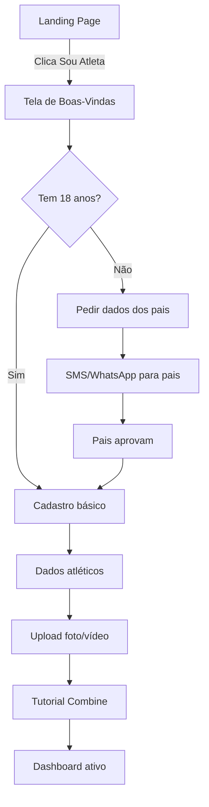
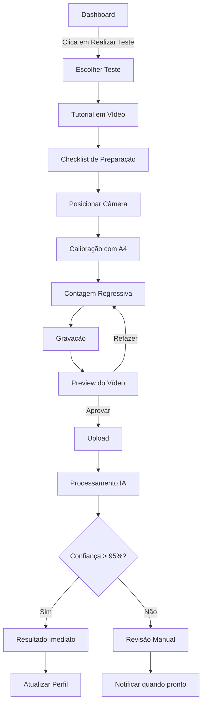
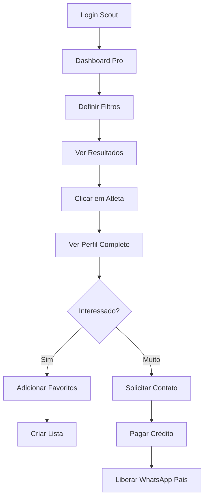
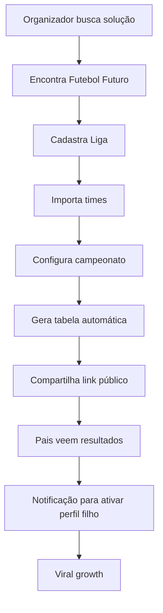

# Futebol Futuro - Guia de Implementação e Fluxos de Usuário

## 🎯 Resumo Executivo para Desenvolvimento

### O Que Estamos Construindo
Uma plataforma PWA que revoluciona a descoberta de talentos no futebol juvenil brasileiro através de:
1. **Verificação por IA** de métricas de performance
2. **Marketplace bilateral** conectando atletas e scouts
3. **Sistema de gestão gratuito** para ligas (estratégia Cavalo de Troia)

### Personas Principais
1. **João (16 anos)** - Atacante talentoso de Osasco que nunca foi visto por scouts
2. **Carlos** - Scout do Palmeiras que gasta 80% do tempo em viagens improdutivas
3. **Ana** - Mãe do João, quer dar visibilidade ao filho mas não tem conexões
4. **Roberto** - Organizador de liga amadora que usa Excel para tudo

---

## 📱 Fluxos de Usuário Detalhados

### FLUXO 1: Onboarding do Atleta (Mobile-First)



**Telas Específicas:**

#### 1.1 Tela de Boas-Vindas
```javascript
// Componente: WelcomeScreen.jsx
const messages = [
  "🌟 Bem-vindo ao Futebol Futuro!",
  "⚽ Vamos mostrar seu talento para o Brasil inteiro",
  "📊 Com dados verificados, não com sorte",
  "🚀 Pronto para começar sua jornada?"
];
```

#### 1.2 Verificação Parental (LGPD Compliance)
```javascript
// Componente: ParentalConsent.jsx
const consentFlow = {
  step1: "Informar telefone dos responsáveis",
  step2: "Enviar código via WhatsApp",
  step3: "Pais acessam link único",
  step4: "Leem termos simplificados",
  step5: "Aprovam com código",
  step6: "Atleta liberado"
};
```

#### 1.3 Perfil Atlético Inicial
```javascript
// Campos essenciais para matching
const athleticProfile = {
  primaryPosition: ['GK', 'CB', 'LB', 'RB', 'CDM', 'CM', 'CAM', 'LW', 'RW', 'ST'],
  secondaryPosition: optional,
  preferredFoot: ['Direito', 'Esquerdo', 'Ambidestro'],
  height: number, // cm
  weight: number, // kg
  currentTeam: string,
  yearsPlaying: number,
  achievements: multiselect
};
```

### FLUXO 2: Realização do Combine Digital



**Implementação Técnica:**

#### 2.1 Gravação In-App (Prevenção de Fraude)
```javascript
// Componente: CombineRecorder.jsx
const RecorderConfig = {
  video: {
    facingMode: 'environment',
    width: { ideal: 1920 },
    height: { ideal: 1080 },
    frameRate: { ideal: 60, min: 30 }
  },
  metadata: {
    timestamp: Date.now(),
    deviceId: getDeviceFingerprint(),
    gpsCoordinates: optional,
    appVersion: APP_VERSION
  }
};
```

#### 2.2 Sistema de Calibração
```javascript
// Usa objeto de referência conhecido (A4 = 210x297mm)
const CalibrationSystem = {
  detectA4Paper: () => {
    // Computer vision para detectar folha A4
    // Calcula pixels por centímetro
    // Ajusta medições baseado na calibração
  },
  alternativeObjects: [
    { name: 'Bola oficial', diameter: 22cm },
    { name: 'Cone parceiro', height: 23cm }
  ]
};
```

### FLUXO 3: Scout Descobrindo Talentos



**Features Específicas do Scout:**

#### 3.1 Sistema de Filtros Avançados
```javascript
// Componente: AdvancedFilters.jsx
const FilterPresets = {
  'Lateral Rápido': {
    positions: ['LB', 'RB'],
    sprint20m: { max: 2.8 },
    age: { min: 15, max: 17 }
  },
  'Meia Criativo': {
    positions: ['CAM', 'CM'],
    assists: { min: 5 },
    keyPasses: { min: 20 }
  },
  'Centroavante Goleador': {
    positions: ['ST'],
    goals: { min: 10 },
    shotsOnTarget: { min: 70 } // percentage
  }
};
```

#### 3.2 Visualização de Dados
```javascript
// Componente: AthleteRadarChart.jsx
const PerformanceMetrics = {
  physical: {
    speed: percentile(sprint20m),
    agility: percentile(shuttle),
    stamina: percentile(beepTest)
  },
  technical: {
    ballControl: percentile(wallPass),
    finishing: percentile(shootingAccuracy),
    passing: percentile(passingTest)
  },
  tactical: {
    positioning: coachRating,
    gameVision: coachRating,
    decisionMaking: coachRating
  }
};
```

### FLUXO 4: Liga Usando Software Gratuito



---

## 🛠️ Arquitetura Técnica para Replit

### Backend Structure
```javascript
// server/index.js
const express = require('express');
const app = express();

// Core APIs
app.use('/api/auth', authRoutes);
app.use('/api/athletes', athleteRoutes);
app.use('/api/scouts', scoutRoutes);
app.use('/api/combine', combineRoutes);
app.use('/api/leagues', leagueRoutes);
app.use('/api/verification', verificationRoutes);

// Webhook for video processing
app.post('/webhook/video-processed', handleVideoResults);
```

### Database Schema (PostgreSQL)
```sql
-- Core Tables
CREATE TABLE athletes (
  id UUID PRIMARY KEY,
  cpf VARCHAR(11) UNIQUE,
  name VARCHAR(255),
  birth_date DATE,
  city VARCHAR(100),
  state VARCHAR(2),
  verification_level ENUM('bronze', 'silver', 'gold', 'platinum'),
  created_at TIMESTAMP
);

CREATE TABLE combine_tests (
  id UUID PRIMARY KEY,
  athlete_id UUID REFERENCES athletes(id),
  test_type VARCHAR(50),
  video_url TEXT,
  ai_confidence DECIMAL(3,2),
  verified_metrics JSONB,
  status ENUM('processing', 'verified', 'rejected', 'manual_review'),
  created_at TIMESTAMP
);

CREATE TABLE scout_searches (
  id UUID PRIMARY KEY,
  scout_id UUID,
  filters JSONB,
  results_count INT,
  created_at TIMESTAMP
);
```

### Componentes React Essenciais
```javascript
// client/src/components/structure.js
const AppStructure = {
  // Layouts
  'layouts/': ['PublicLayout', 'AthleteLayout', 'ScoutLayout', 'AdminLayout'],
  
  // Common Components  
  'common/': [
    'TrustPyramid',
    'AthleteCard', 
    'VideoUploader',
    'MetricsChart',
    'FilterBuilder'
  ],
  
  // Feature Modules
  'features/': {
    'athlete/': ['Dashboard', 'Profile', 'Combine', 'Progress'],
    'scout/': ['Search', 'Favorites', 'Reports', 'Contact'],
    'league/': ['Management', 'Tables', 'Stats', 'Integration']
  },
  
  // Utilities
  'utils/': ['api', 'auth', 'validation', 'videoProcessing']
};
```

---

## 🎨 Design System Específico

### Componentes Visuais Brasileiros
```css
/* Botão estilo brasileiro */
.btn-brasil {
  background: linear-gradient(135deg, #009C3B 0%, #FFDF00 100%);
  color: white;
  font-weight: bold;
  text-transform: uppercase;
  letter-spacing: 1px;
  transition: all 0.3s;
  box-shadow: 0 4px 15px rgba(0, 156, 59, 0.3);
}

/* Card de atleta */
.athlete-card {
  background: white;
  border-radius: 16px;
  overflow: hidden;
  transition: transform 0.3s, box-shadow 0.3s;
  border: 2px solid transparent;
}

.athlete-card:hover {
  transform: translateY(-4px);
  box-shadow: 0 8px 24px rgba(0, 0, 0, 0.1);
  border-color: #009C3B;
}

/* Badge de verificação */
.verification-badge {
  display: inline-flex;
  align-items: center;
  padding: 4px 12px;
  border-radius: 999px;
  font-size: 12px;
  font-weight: 600;
  text-transform: uppercase;
}

.badge-platinum {
  background: linear-gradient(135deg, #8B5CF6 0%, #6366F1 100%);
  color: white;
}
```

### Micro-Interações
```javascript
// Animações com Framer Motion
const athleteCardVariants = {
  hidden: { opacity: 0, y: 20 },
  visible: { 
    opacity: 1, 
    y: 0,
    transition: { duration: 0.4, ease: "easeOut" }
  },
  hover: {
    y: -4,
    transition: { duration: 0.2 }
  }
};

const celebrationAnimation = {
  initial: { scale: 0, rotate: -180 },
  animate: { 
    scale: 1, 
    rotate: 0,
    transition: { 
      type: "spring",
      stiffness: 200,
      damping: 15
    }
  }
};
```

---

## 📊 MVP Metrics & Analytics

### Eventos para Rastrear
```javascript
// analytics.js
const trackingEvents = {
  // Athlete Journey
  'athlete_signup_started': { category: 'onboarding' },
  'athlete_profile_completed': { category: 'activation' },
  'combine_test_started': { category: 'engagement' },
  'combine_test_completed': { category: 'engagement' },
  'verification_achieved': { category: 'achievement', level: 'platinum' },
  
  // Scout Journey
  'scout_search_performed': { category: 'usage', filters: {...} },
  'athlete_profile_viewed': { category: 'engagement' },
  'contact_requested': { category: 'conversion' },
  
  // Business Metrics
  'subscription_started': { category: 'revenue', plan: 'pro' },
  'league_partnership_created': { category: 'growth' }
};
```

---

## 🚀 Checklist de Implementação para Replit

### Semana 1: Fundação
- [ ] Setup inicial do Replit com Node.js e React
- [ ] Configurar PostgreSQL database
- [ ] Implementar autenticação básica
- [ ] Criar landing page responsiva
- [ ] Setup do design system

### Semana 2: Core do Atleta
- [ ] Fluxo de onboarding completo
- [ ] Dashboard do atleta
- [ ] Upload de vídeo básico
- [ ] Perfil visualizável

### Semana 3: Core do Scout  
- [ ] Dashboard profissional
- [ ] Sistema de busca básico
- [ ] Visualização de atletas
- [ ] Filtros funcionais

### Semana 4: Combine Digital
- [ ] Interface de gravação
- [ ] Sistema de calibração
- [ ] Integração com processamento
- [ ] Exibição de resultados

### Semana 5: Features Avançadas
- [ ] Pirâmide da Confiança visual
- [ ] Sistema de notificações
- [ ] Gamificação básica
- [ ] PWA configuration

### Semana 6: Polish & Launch
- [ ] Animações e transições
- [ ] Otimização mobile
- [ ] Testes com usuários
- [ ] Deploy e monitoramento

---

## 🎯 Mensagem Final

Este projeto tem o potencial de transformar vidas. Cada linha de código que você escrever pode ser a diferença entre um talento descoberto e um sonho perdido. 

Vamos construir com paixão, propósito e a excelência técnica que o futebol brasileiro merece! 🇧🇷⚽✨

**#VamosFutebolFuturo**